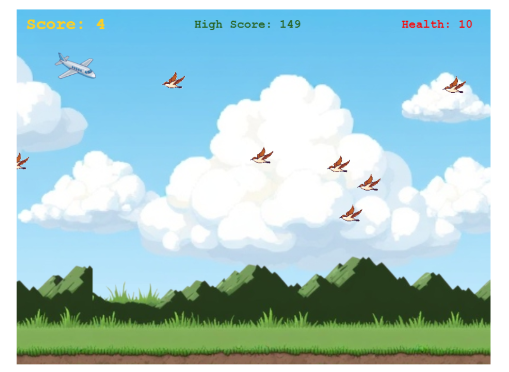

# Phaser Airplane Game

A fun and simple airplane game built using Phaser 3. Control an airplane, avoid birds, and try to achieve the highest score possible! This package is ideal for web applications looking to integrate an interactive game with minimal setup.



## Features

- Airplane controls for smooth movement
- Birds as obstacles, with collision detection
- Health system and score tracking
- High score saved in local storage
- Pause, resume, and restart game options

## Table of Contents

- [Installation](#installation)
- [Controls](#controls)
- [Gameplay](#gameplay)
- [Development](#development)
- [License](#license)

## Controls

- **Arrow Keys**: Control airplane movement (Up, Down, Left, Right)
- **Spacebar**: Pause and resume the game
- **Restart Button**: Available after game over to restart the game

## Gameplay

1. Press the **Play** button to start.
2. Use arrow keys to dodge birds while maintaining health.
3. Try to achieve the highest score!

## Development

If you wish to modify the game code, clone this repository and run the following commands:

1. **Install dependencies**:
   ```bash
   npm install
   ```

2. **Run the game locally**:
   ```bash
   npm run dev
   ```

3. **Build for production**:
   ```bash
   npm run build
   ```

## License

This project is licensed under the MIT License.
```

### Instructions:
- Add the screenshot (`screenshot.png`) to the `assets` folder in your repository.
- Update any paths in the README if needed. 

This `README.md` is ready to be uploaded to GitHub.